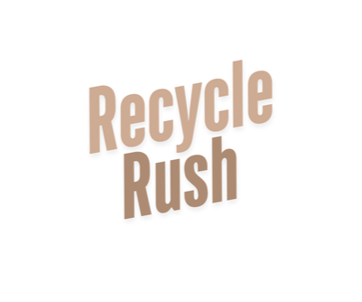

# Recycling-Games

  
  

 

*Recycling-Games* is a Unity project that features two distinct, engaging games aimed at teaching players about recycling and waste management.

* Recycle Dash: An *endless runner* where players collect trash items while navigating through obstacles. And after collecting a certain number of items the player has to sort the items.
* Recycle Rush: A *drag-and-drop sorting game* where players must sort the items into the correct recycling bins.

This project combines fun gameplay with educational content to promote environmental awareness.

---

## Table of Contents

-   [Getting Started](#-getting-started)
-   [How to Play](#-how-to-play)
-   [PlayFab Integration](#-playfab-integration)
-   [Building for Android](#-building-for-android)
-   [License](#-license)

---

## 🚀 Getting Started

To get a copy of the project up and running on your local machine, follow these steps.

### Prerequisites

You'll need to have *Unity Hub* and *Unity version 2022.3.62f1* installed. The project can be opened in other Unity versions as well, but it is recommended to use the original version to avoid potential complications.

### Installation

1.  *Clone the repository:*
    bash
    git clone [https://github.com/PASCL-Lab/Recycling-Games.git](https://github.com/PASCL-Lab/Recycling-Games.git)
    
2.  *Open the project in Unity:*
    * Open *Unity Hub*.
    * Click *Add* and select the folder where you cloned the project.
    * Unity will handle any necessary upgrades or downgrades.
3.  *Verify dependencies:*
    * Ensure all required packages are installed. Check the Packages/manifest.json file to see if anything is missing.

---

## 🎮 How to Play

### Starting the Games

* **Main Runner Game (Recycle Dash):** Open Assets/GameData/Scenes/LoadingScreen.unity.
* **Standalone Sorting Game (Recycle Rush):** Open Assets/GameData/Scenes/Menu.unity.

---

## ☁ PlayFab Integration

Both games use *PlayFab* for storing player scores and managing leaderboards.

### 1. Create a PlayFab Account

* Go to the [PlayFab website](https://playfab.com/) and sign up for an account.

### 2. Create New Titles

* Within your PlayFab account, create two separate titles (games) for each game:
    * Recycle Dash (for the runner game)
    * Recycle Rush (for the sorting game)

### 3. Create Leaderboards

* For each title, create a *Legacy Leaderboard* table.
* The leaderboard must be named **High_Score** to work with the default code. If you wish to change the name, you must also update the StatisticName field in the ScoreManager.cs script.

### 4. Configure Unity

* In Unity, navigate to Assets/PlayFabSDK/Shared/Public/Resources.
* Click on **PlayFabSharedSettings**.
* Enter the correct Title IDs for each game:
    * Recycle Dash → Dash Title ID
    * Recycle Rush → Rush Title ID

### 5. Verify Integration

* Test the game in Unity to ensure scores are correctly being saved to and retrieved from PlayFab.

---

## ⚙ Building for Android

### Recycle Dash

* Ensure the correct Title ID is set in the PlayFabSharedSettings.
* Include the following scenes in your build settings in this order:
    1.  LoadingScreen
    2.  CharacterSelect
    3.  MainGameplay
    4.  SortingPhase

### Recycle Rush

* Ensure the correct Title ID is set in the PlayFabSharedSettings.
* Include the following scenes in your build settings in this order:
    1.  Menu
    2.  GarbageSorting

---
